# Global Financial Pond Model

This document describes the financial model flow.

Each pool must be internally closed and independently understandable.
External variables connect through nodes and edges.

```mermaid
flowchart TB
    subgraph UP["Upstream Macro Drivers"]
        USDL["USD Liquidity"]
        RR["US Real Rate"]
        DXY["US Dollar Index"]
        VIX["Risk Appetite / VIX"]
        CS["Credit Spread"]
        CNYL["China Credit / Liquidity\nSocial Financing / M1 / M2 / DR007"]
        GEO["Geopolitical Risk"]
        INF["Inflation Expectation"]
        STBL["Stablecoin Liquidity"]
        POLICY["Policy / Regulatory Expectations"]
    end

    REG["Global Regime Engine\nRisk-on / Risk-off / Dollar Squeeze /\nChina Credit Impulse / Reflation / Disinflation"]

    subgraph PONDS["Core Ponds"]
        USEQ["US Equity Pool"]
        ASH["A-share Pool"]
        BTCP["BTC Pool"]
        GP["Gold Pool"]
        HKP["HK Equity Pool (future)"]
    end

    subgraph INT["Internal Logic of Each Pool"]
        UPST["Upstream Score"]
        INFL["Inflow Score"]
        RET["Retention Score"]
        DOWN["Downstream Diffusion Score"]
        NEWS["News Expectation Score"]
        CONF["Market Confirmation Score"]
    end

    subgraph SEC["Sector / Child Pools"]
        USS["US Sectors\nTech / Semis / Financials / Energy / Healthcare"]
        ASS["A-share Sectors\nSemis / Brokers / AI / Military / Consumer / Pharma"]
        BTCS["Crypto Child Pools\nETH / Miners / Exchanges / Alt Beta"]
        GS["Gold Child Pools\nGold Miners / Silver / Precious Metals"]
        HKS["HK Sectors\nInternet / Financials / China-linked sectors"]
    end

    ETF["ETF / Index / Asset Layer"]
    PORT["User Portfolio"]

    USDL --> REG
    RR --> REG
    DXY --> REG
    VIX --> REG
    CS --> REG
    CNYL --> REG
    GEO --> REG
    INF --> REG
    STBL --> REG
    POLICY --> REG

    USDL --> USEQ
    RR --> USEQ
    VIX --> USEQ
    CS --> USEQ
    POLICY --> USEQ

    CNYL --> ASH
    POLICY --> ASH
    VIX --> ASH
    DXY --> ASH

    USDL --> BTCP
    RR --> BTCP
    STBL --> BTCP
    VIX --> BTCP
    POLICY --> BTCP

    RR --> GP
    DXY --> GP
    GEO --> GP
    INF --> GP
    POLICY --> GP

    USDL --> HKP
    CNYL --> HKP
    POLICY --> HKP
    VIX --> HKP
    DXY --> HKP

    REG --> USEQ
    REG --> ASH
    REG --> BTCP
    REG --> GP
    REG --> HKP

    USEQ --> UPST
    USEQ --> INFL
    USEQ --> RET
    USEQ --> DOWN
    USEQ --> NEWS
    USEQ --> CONF

    ASH --> UPST
    ASH --> INFL
    ASH --> RET
    ASH --> DOWN
    ASH --> NEWS
    ASH --> CONF

    BTCP --> UPST
    BTCP --> INFL
    BTCP --> RET
    BTCP --> DOWN
    BTCP --> NEWS
    BTCP --> CONF

    GP --> UPST
    GP --> INFL
    GP --> RET
    GP --> DOWN
    GP --> NEWS
    GP --> CONF

    HKP --> UPST
    HKP --> INFL
    HKP --> RET
    HKP --> DOWN
    HKP --> NEWS
    HKP --> CONF

    USEQ --> USS
    ASH --> ASS
    BTCP --> BTCS
    GP --> GS
    HKP --> HKS

    USS --> ETF
    ASS --> ETF
    BTCS --> ETF
    GS --> ETF
    HKS --> ETF

    USEQ --> ETF
    ASH --> ETF
    BTCP --> ETF
    GP --> ETF
    HKP --> ETF

    ETF --> PORT
```



## Pool Closure Rule

Every pool must be readable as a closed module:

```text
inputs -> internal components -> final score -> explanation -> downstream output
```

The graph may connect pools, but a pool's internal logic must be defined in configuration and documentation.

## Shared Internal Components

Each pool may calculate:

- Upstream Score
- Inflow Score
- Retention Score
- Downstream Diffusion Score
- News Expectation Score
- Market Confirmation Score
- Regime Adjustment

These components should be configurable per pool.
