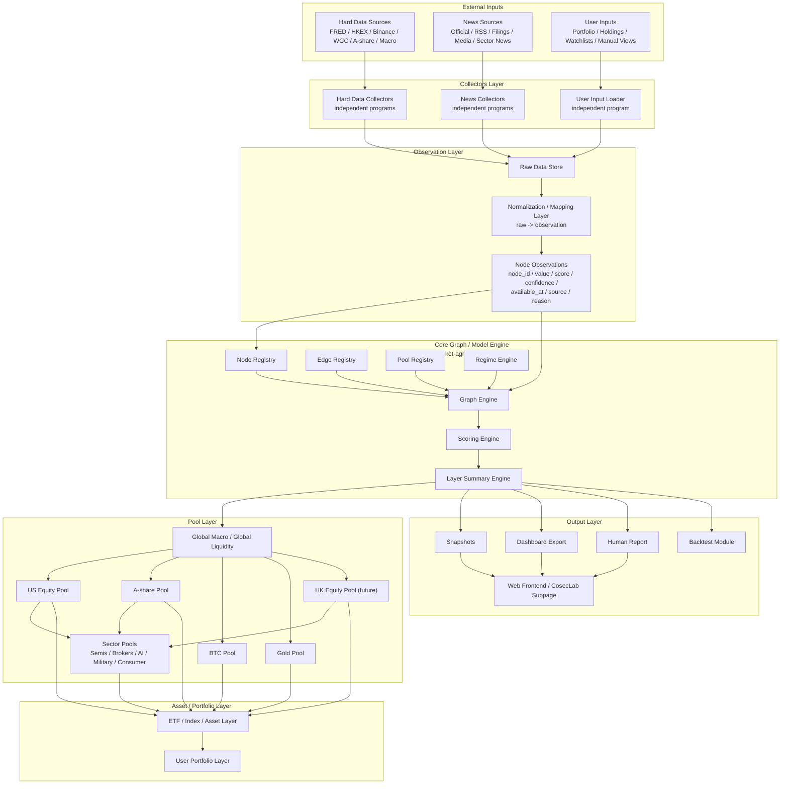

# System Architecture Diagram

This diagram is the high-level engineering map for the project.

The core rule is:

```text
External data, news, user holdings, backtests, and UI must connect through stable interfaces.
They must not bypass or rewrite the graph engine.
```



## Notes

- Hard data, news, and user holdings are independent input lanes.
- All lanes become node observations before entering the graph.
- The UI renders exported graph data. It does not calculate financial logic.
- Future backtests should consume historical observations and snapshots, not mutate core rules.
